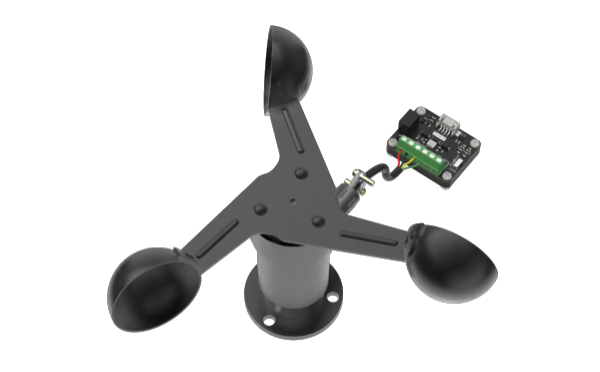
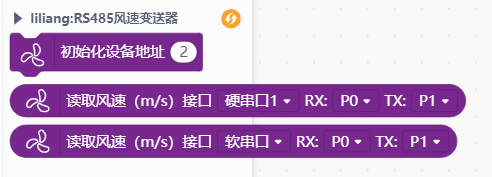

# SEN0483 RS485风速变送器




---------------------------------------------------------

## 目录

* [相关链接](#相关链接)
* [描述](#描述)
* [积木列表](#积木列表)
* [示例程序](#示例程序)
* [许可证](#许可证)
* [支持列表](#支持列表)
* [更新记录](#更新记录)

## 相关链接
* 本项目加载链接: ```https://github.com/liliang9693/ext-windspeed```

* 用户库教程链接: ```https://mindplus.dfrobot.com.cn/extensions-user```

* 商品链接: 
    * 风速传感器：```https://www.dfrobot.com.cn/goods-3195.html```
    * RS485转UART模块：```https://www.dfrobot.com.cn/goods-3283.html```


## 描述
可以从Mind+中加载RS485风速传感器的扩展，注意需搭配RS485转UART模块使用(DFR0845)。

## 积木列表




## 示例程序


## 许可证

MIT

## 支持列表

主板型号                | 实时模式    | ArduinoC   | MicroPython    | 备注
------------------ | :----------: | :----------: | :---------: | -----
micro:bit        |             |       √       |             | 
mpython        |             |        √      |             | 
arduino        |             |        √      |             | 


## 更新日志
* V0.0.1  基础功能完成